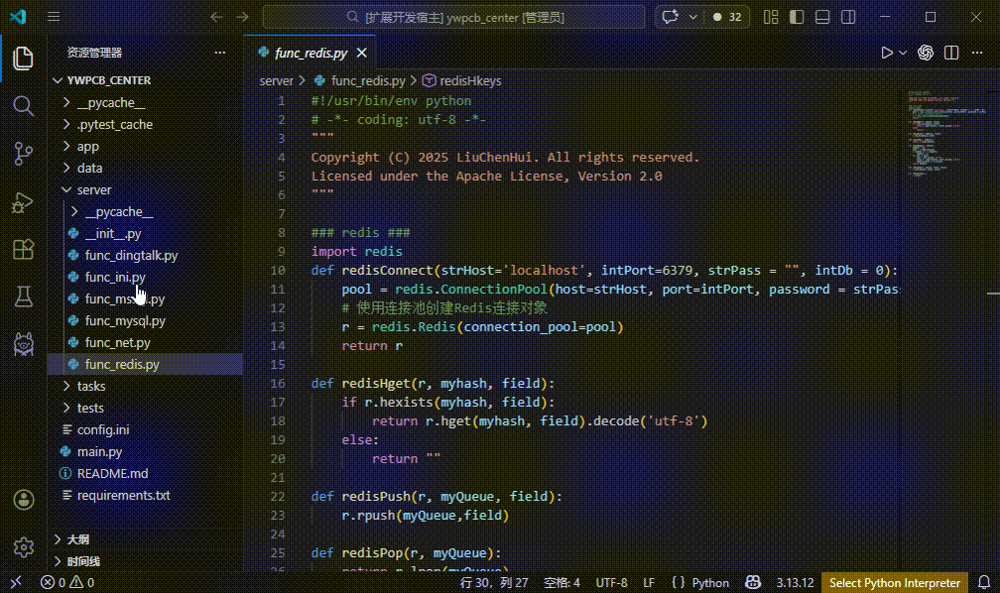

# Code Tools

author: 刘晨辉

`Code Tools` 是一个用于 VS Code 的小工具扩展集合，其他功能将陆续完善，欢迎大家提需求。
1、`Dos2Unix` 命令，用来将 Windows 行尾格式 `CRLF (\r\n)` 转换为 Unix 行尾格式 `LF (\n)`，并去掉常见的 `^M`

## Features

- 支持对单个文件执行 `CRLF -> LF` 转换。
- 支持在资源管理器中选择文件夹后递归处理其下全部文件。
- 未在资源管理器中选择目标时，会自动处理当前编辑器中的活动文件。
- 已打开文件会通过编辑器接口更新并保存，未打开文件会直接写回磁盘。
- 会自动跳过疑似二进制文件，降低误处理图片、可执行文件等内容的风险。
- 批量处理文件夹时会显示进度，并在完成后给出转换结果汇总。

## Usage

## 1、Dos2Unix说明

### 处理单个文件

1. 在 VS Code 资源管理器中右键目标文件。
2. 执行 `Dos2Unix`。

也可以直接打开文件后，从命令面板运行 `Dos2Unix`。

### 处理整个文件夹

1. 在 VS Code 资源管理器中右键目标文件夹。
2. 执行 `Dos2Unix`。
3. 扩展会自动递归遍历该目录下的所有文件，并将行尾统一转换为 `LF`。

## Behavior

- 已经是 Unix 行尾的文件不会被重复修改。
- 处理目录时会跳过符号链接目录，避免递归进入不受控路径。
- 如果目标中包含疑似二进制文件，这些文件会被跳过，并在结果提示中统计数量。

## Requirements

无需额外配置，安装后即可使用。

## Extension Settings

当前版本没有新增自定义配置项。

## Known Issues

- 当前二进制文件识别采用轻量规则，主要用于避免明显的误处理场景。

## Release Notes

详细变更请查看 [CHANGELOG.md](./CHANGELOG.md)。
